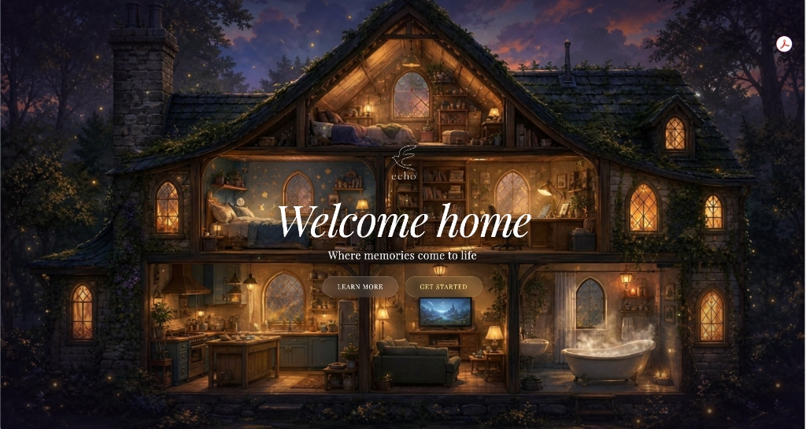
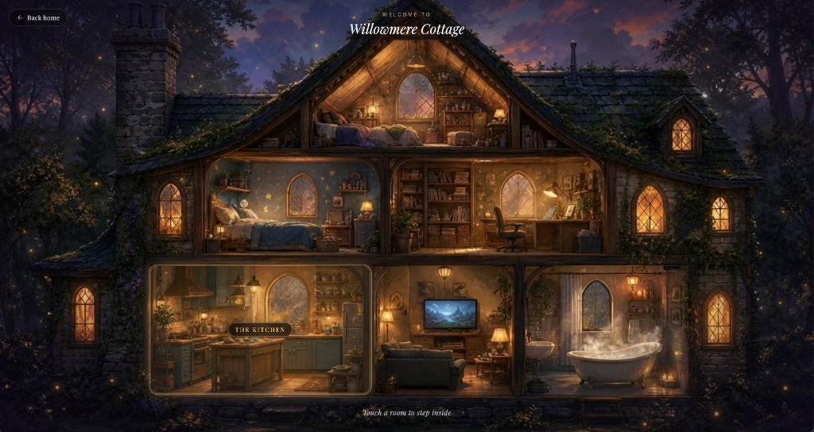
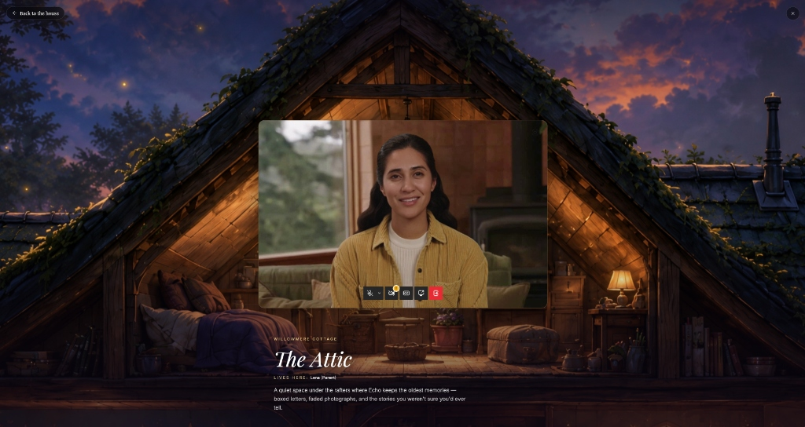
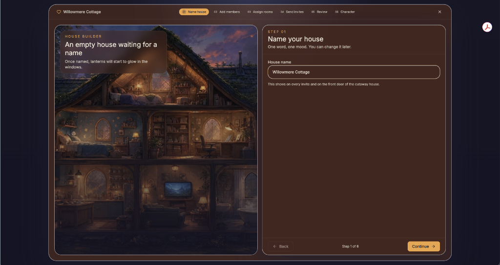
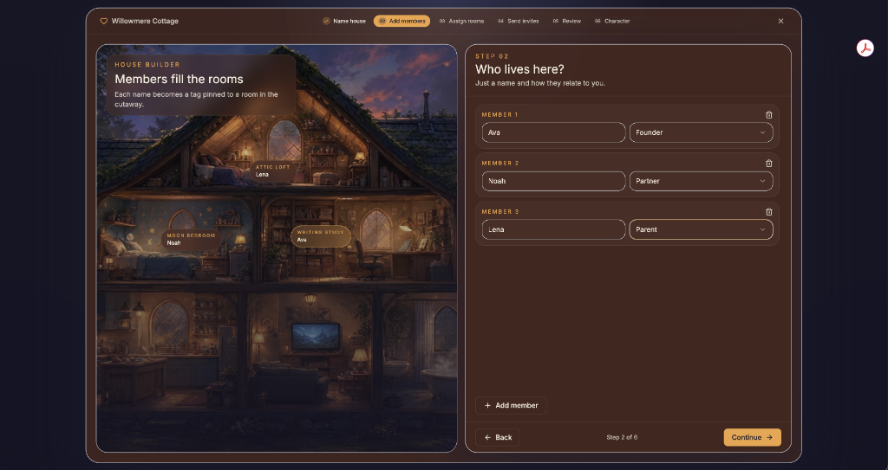
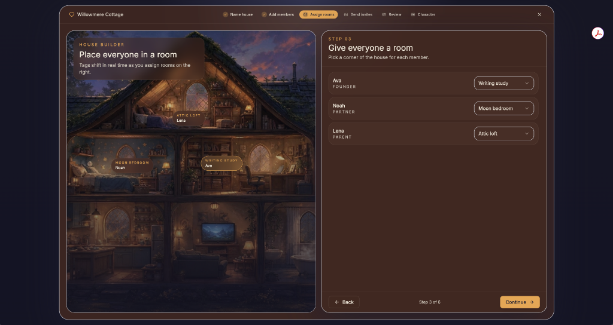
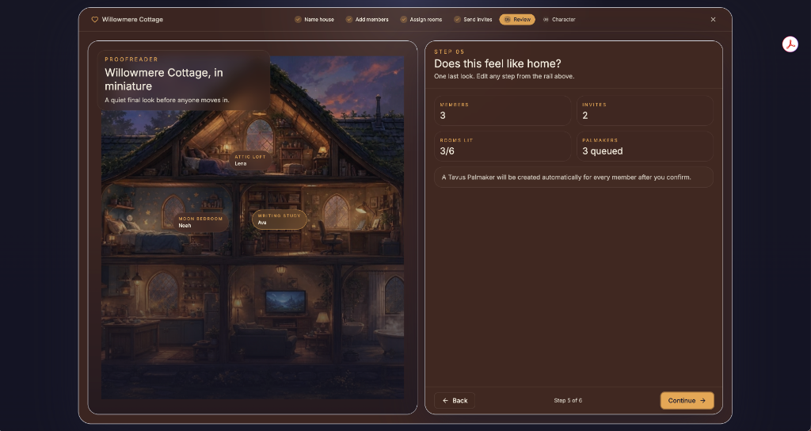
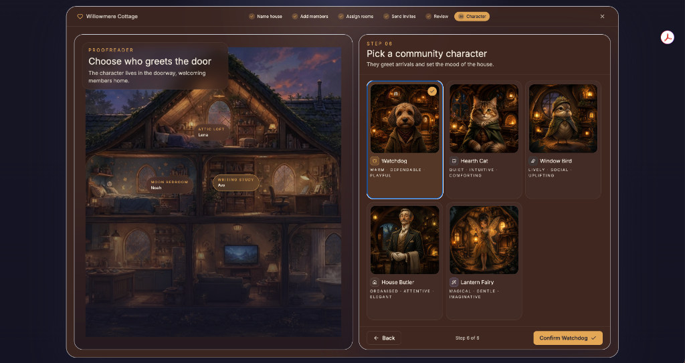

# Echo — Memory, preserved.

Echo is an interactive living digital legacy application designed to preserve the voice, personality, stories, and presence of loved ones in a private, family-controlled environment.

🔗 **Live App**: [dreamhouse-echoes.lovable.app](https://dreamhouse-echoes.lovable.app/)  
💬 **Community Showcase**: [Tavus Showcase](https://community.tavus.io/showcase/echo-u58ex)

---

## 📸 Experience & Screenshots

### 1. Landing Page


---

### 2. Memory Cottage (Home)


---

### 3. Interactive Experience (Tavus Persona Video AI)


---

### 4. Onboarding Flow

| Step 1: Name Your House | Step 2: Add Members |
| :---: | :---: |
|  |  |

| Step 3: Assign Rooms | Step 4: Send Invites |
| :---: | :---: |
|  |  |

| Step 5: Review Configuration | Step 6: Pick a Character |
| :---: | :---: |
|  |  |

---

## 🌟 Key Features

- **Interactive Memory Cottage (`/house`)**: An interactive visual experience mapping family members and their shared stories to themed rooms (The Attic, The Study, The Living Room, Kitchen, etc.).
- **Interactive Persona Conversations**: Integrates with [Tavus](https://www.tavus.io/) video AI technology to engage in natural, conversational interactions with preserved digital personas.
- **Custom Onboarding Flow**: Add family members, allocate memory spaces, select house guardians, and customize legacy details seamlessly.
- **Family-Controlled Privacy**: Designed for secure local configuration and family-governed memory preservation.

## 🛠️ Tech Stack

- **Frontend Core**: [React 19](https://react.dev/), [TypeScript](https://www.typescriptlang.org/)
- **Routing & SSR**: [TanStack Start](https://tanstack.com/start), [TanStack Router](https://tanstack.com/router)
- **Build Tooling & Server**: [Vite 8](https://vitejs.dev/), [Nitro](https://nitro.unjs.io/)
- **Styling & UI**: [Tailwind CSS v4](https://tailwindcss.com/), [Radix UI primitives](https://www.radix-ui.com/), [Lucide React](https://lucide.dev/)
- **AI Integrations**: Tavus Video Persona API (`@tavus/embed`)

## 🚀 Getting Started

### Prerequisites

- [Node.js](https://nodejs.org/) (v18+ recommended) or [Bun](https://bun.sh/)

### Installation

1. **Clone the repository:**
   ```bash
   git clone https://github.com/tharunpoduru/echo.git
   cd echo
   ```

2. **Install dependencies:**
   ```bash
   bun install
   # or
   npm install
   ```

3. **Start the development server:**
   ```bash
   bun run dev
   # or
   npm run dev
   ```

4. **Open your browser:**
   Navigate to `http://localhost:3000` (or the port specified in your console).

## 🗂️ Project Structure

```
├── docs/screenshots/   # Application screenshots for repository documentation
├── src/
│   ├── assets/         # Images, logo assets, and room JSON metadata
│   ├── components/     # UI components and onboarding interactive flows
│   ├── hooks/          # React custom hooks
│   ├── lib/            # Utilities and local storage state persistence (houseStore)
│   ├── routes/         # TanStack Start file-based route definitions
│   ├── server.ts       # SSR error handling and server entry wrapper
│   └── styles.css      # Core styles and custom keyframe animations
├── vite.config.ts      # Vite configuration with TanStack Start integration
└── package.json        # Dependencies and build scripts
```

## 📝 License

This project is proprietary and confidential. All rights reserved.
